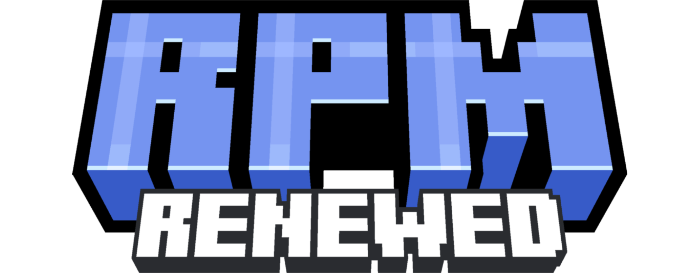

  

  <b>Spigot Plugins Developer | Minecraft Developer | GameDev from Uzbekistan</b>

  
  
  
  

<h3 align="center">🛠️ Tools and APIs I use</h3>

  
  
  
   
  
  
   
  

<h3 align="center">🌐 Socials</h3>

  
  

<h3 align="center">⏱️ Latest project</h3>

  

<s size="10">clickable</s>

<h3 align="center">📊 GitHub Stats</h3>

  

<!--

  

-->

